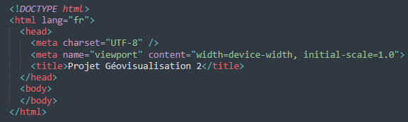
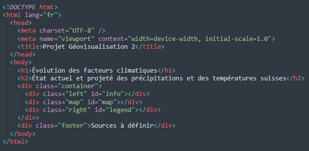

# Réflexions sur le déroulement du projet
Lorena Roulin et Marine Fiora
Université de Lausanne, Mars 2024

# Introduction
Nous prévoyons de réaliser une carte interactive qui présente l'évolution des précipitations et des températures en Suisse, selon les différents scénarios du GIEC.

L'objectif est de montrer les projections mensuelles ou annuelles à l'horizon 2050, en utilisant la période de référence de 1981-2010. Nous voulons construire une carte dans laquelle nous pourrons sélectionner différentes informations telles que des données de précipitaion et de température, l'année de référence, le mois auquel nous voulons voir les données ainsi que des projections futures. Ainsi, il sera possible de visionner les valeurs climatiques dans le passé mais aussi dans le future grâce à des projections climatiques. Les différentes sélections permettrons de choisir l'une des différentes cartes climatiques et de l'afficher. De plus, les différentes informations relatives aux cartes apparaîtrons aussi, sur le côté de l'image. 

Avec cette idée de base en tête, nous allons crée une carte interactive sur internet. Pour se faire, le language HTML sera utilisé. Celui-ci est pratique et peut fonctionner en conjonction avec le langage CSS (style) et le Javascript (JS, pour l'interactivité). Ces différents éléments seront décrits plus tard. 

## Exemple de carte des précipitations 


## Exemple de carte des températures 


### Projection des précipitations dans le futur 
Données sur les précipitations sur le site de la [Confédération suisse](https://www.bafu.admin.ch/). 

### Projection des températures dans le futur 
Données sur les températures : encore à trouver

# Cours du 10.04.2024
A ce stade, nous avons trouvé plusieurs données climatiques. En premier, nous avons des données climatiques concernant directements les différentes stations météorologiques en Suisse. Nous avons trouvé [ces données](https://www.meteosuisse.admin.ch/services-et-publications/applications/ext/climate-tables-homogenized.html) grâce à l'aide du Professeur Fallot, qui nous les a indiquées. Cependant, nous ne pensons pas que ce soient les meilleures données à disposition, car elles ne montrent pas l'évolution future des températures.

Nous avons ensuite trouvé certaines données climatiques sur le [site de la confédération](https://www.bafu.admin.ch/bafu/fr/home/etat/donnees/geodonnees/forets--geodonnees.html). Celles-ci présentent des projections des températures maximales journalières de l'air en juillet, selon les RCP 2.6, 4.5 et 8.5. Nous considérons que ces données seront bien plus précieuses. De plus, nous avons également des données concernant les précipitations cumulées entre avril et août, de nouveau en fonction des mêmes RCP. Cela est intéressant, car il nous sera possible de calculer à l'échelle annuelle si c'est la direction que nous voulons suivre. Nous ne savons pas encore si ces données sont suffisamment précises. Ces informations sont majoritairement au format DB (GDBTABLE), qui peut être ouvert avec des logiciels comme ArcGIS.

Nous avons aussi vu qu'il était possible de commander des données sur Idaweb. Mais nous devons en discuter encore ensemble. 

# Rendez-vous du 13.04.2024
Nous nous sommes rendu compte que nous n'avions pas les données nécessaires pour les températures, car les données minimales ne sont pas disponibles, ni les données annuelles. Nous avons donc décidé de commander des données sur l'Idaweb. Nous avons besoin de la signature du professeur responsable pour accéder à ces données.

Sur la carte, nous pensions afficher la carte de la Suisse avec, sur le côté, les onglets correspondant aux RCP. Nous pouvons également ajouter une barre verticale que l'on peut déplacer de droite à gauche pour comparer plusieurs scénarios sélectionnés.

Nous avons aussi l'idée de pouvoir zoomer sur les différentes régions. Cependant, nous ne savons pas encore exactement comment cela sera réalisé, car cela dépend des données disponibles. Nous nous demandons également si nous devons sélectionner tous les cantons ou si nous devrions nous concentrer sur l'ouest de la Suisse (Suisse romande) pour obtenir des données potentiellement plus précises.

A voir comment sera faite la map: js, d3?

# Cours du 17.04.2024

Nous avons fait signer le document par M. Kaiser, que nous allons envoyer à MétéoSuisse.

# Rendez-vous du 27.04.2024
Lorena a reçu les données de l'IDAweb, mais nous ne savons pas encore exactement comment les utiliser. Marine a également trouvé des données raster concernant les précipitations ainsi que les températures en fonction des différents scénarios. Ces données peuvent être ouvertes dans QGIS, mais nous ne savons pas comment les lire. Nous devons en discuter avec M. Kaiser pour savoir exactement comment utiliser ces données et si elles sont exploitables.

Pour ne pas perdre trop de temps, nous avons réfléchi à la forme que nous souhaitons donner à notre projet. Il sera sûrement présenté sous cette forme :


## Décortiquons la carte
Sur la gauche de la carte, nous retrouverons les informations fixes ; au centre se trouvera la carte et, à droite, les informations qui varient en fonction des sélections faites dans le menu de gauche.

À gauche, nous trouverons plusieurs menus déroulants. Nous avons choisi d'opter pour des menus déroulants, notamment par souci de lisibilité. De cette manière, l'utilisateur pourra sélectionner plusieurs options, et seulement celles-ci apparaîtront. Il y a globalement trois choix pour l'utilisateur.

1. Le thème de la carte : précipitations ou températures.
2. L'année : de référence 1981-2010 ou projections pour les années 2020-2049. 
3. Le scénario du GIEC : RCP2.6, RCP4.5, RCP8.5. 

Si l'utilisateur ne souhaite pas faire de projections futures, il peut choisir de ne sélectionner que le thème de la carte, qui s'affichera avec la période de référence actuelle, soit 1981-2010. S'il désire des informations plus précises, il peut sélectionner les options 2 et 3.

De plus, sous ces choix se trouve l'option "Comparer", qui permet de faire un second ensemble de choix. C'est une section identique à celle des choix précédents. Ainsi, deux ensembles de choix pourront apparaître sur la carte, ce qui permet une meilleure comparaison. Cette comparaison peut être effectuée directement sur la carte, en utilisant une barre verticale qui sert de curseur. En déplaçant le curseur, les données d'un choix ou d'un autre apparaissent sur la carte.

La carte, située au centre, occupera la majorité de l'écran. On y trouvera la Suisse avec un choix de plusieurs fonds de carte (tels que MNT, relief, etc.). Une fonction de zoom permettra de voir plus précisément une région. Nous devrons limiter le zoom en fonction de la résolution des pixels des données à disposition. Toutes les informations nécessaires aux cartes (flèche du nord, échelle, source, auteurs, etc.) seront également présentes.

Sur la droite se trouvent les informations variables. Au sommet de cette partie, le thème sélectionné sera repris et fera office de titre. Sous celui-ci se trouvera un texte explicatif qui apparaîtra selon les sélections faites à gauche. Cela aidera à la compréhension et à la lecture de la carte. Nous trouverons également dans cet espace les différentes légendes.

## Pourquoi ces choix ?
Nous souhaitons que la carte soit la plus claire possible, avec une partie "choix," une partie "carte" et une partie "informations." Nous avons choisi la logique du F, avec les informations les plus importantes sur la gauche, là où le regard se pose en premier. C'est également la partie la plus essentielle de la carte, car elle permet de sélectionner ce que l'on veut voir. Cette section n'est cependant pas excessivement large, afin de laisser le plus de place possible pour la visualisation des données.

Le choix du menu déroulant est vraiment une question de lisibilité. Nous voulons que cette partie soit la plus claire et compréhensible possible. En effet, less is more. Nous avons également décidé d'inclure la section "choix de comparaison" dans cette partie afin de garantir une lisibilité optimale. Le fait de mettre côte à côte les deux choix permet aussi une meilleure comparaison.

La carte est située au centre, ce qui permet de diviser les informations textuelles et d'aérer l'ensemble. L'objectif est évidemment de rendre cette carte la plus grande possible.

La partie droite comprend des informations relatives à ces choix ainsi que les légendes qui leur sont liées. Elle suit également la logique de gauche à droite : choix → visualisation → explications. 

## Données
Nous avons envoyé un e-mail à MétéoSuisse afin de comprendre comment lire les différentes données. Nous avons également choisi de nous restreindre, dans un premier temps, à la température et aux précipitations. De plus, nous souhaitons modifier le nombre d'onglets de possibilités concernant les choix de probabilité.


# Marche à suivre pour la réalisation de la carte interactive
Dans ce travail, nous allons donc créer une carte interactive permettant de sélectionner différentes informations, telles que les données de précipitations et de températures, l'année de référence, le mois pour lequel nous voulons voir les données, ainsi que des projections futures. Il sera ainsi possible de visualiser les valeurs climatiques du passé mais aussi du futur grâce aux projections climatiques. Les différentes options permettront de choisir l'une des cartes climatiques et de l'afficher. De plus, les informations relatives aux cartes apparaîtront également sur le côté de l'image.

Avec cette idée de base en tête, nous allons créer une carte interactive en ligne. Pour ce faire, le langage HTML sera utilisé. Celui-ci est pratique et peut fonctionner en conjonction avec le CSS (pour le style) et le JavaScript (JS, pour l'interactivité). Ces différents éléments seront décrits plus tard.

# 1. Créer la base du HTML
Pour commencer, un document HTML a été créé et est composé de plusieurs éléments. Dans notre cas, nous allons nous concentrer sur trois d'entre eux : `<html>`, `<head>`, et `<body>`.

Chaque élément fonctionne comme un tiroir qui peut contenir d'autres éléments. Pour ajouter un élément, vous devez l'ouvrir en utilisant des chevrons autour de son nom, comme ceci : <...>. Pour fermer cet élément, vous devez ajouter un / à l'intérieur des chevrons, comme ceci : </...>. Cette logique est utilisée pour chaque élément de l'HTML.



Par exemple : l'élément HTML principal s'ouvre avec  `<html>` et se ferme avec `</html>`. À l'intérieur de la balise html, vous pouvez avoir un `<head>` pour les métadonnées et un `<body>` pour le contenu visible de la page, chacun ayant sa propre balise d'ouverture et de fermeture.

## 1.1 Les métadonnées

Pour commencer, certaines métadonnées peuvent déjà être écrites. Il s'agit ici de 
`<meta charset="UTF-8" />` qui est un système d'encodage, ainsi que `<meta name="viewport" content="width=device-width, initial-scale=1.0">` qui permet de rendre la page réactive sur différents mobiles (mais celle-ci n'est pas obligatoire). 

## 1.2 Le contenu de la page web
Pour notre carte, nous voulons créer trois parties principales. La première étape est alors de diviser l'écran en différentes parties en utilisant des div. Une div est donc un élément HTML utilisé pour créer des sections sur une page web et ainsi structurer notre code et notre page. Il est aussi possible de mettre des titres et des sous-titres aux différents éléments. `<h1>...</h1>` correspond au titre un, `<h2>...</h2>` au titre deux et ainsi de suite. 

Ainsi, pour créer notre carte, nous avons besoin de deux balises `<div>`. Le premier `<div>` contiendra les menus de sélection, la carte et les informations, et le second `<div>` sera réservé aux sources. Le premier `<div>` est appelé "container", car il sert de réceptacle pour la majorité du contenu de notre site. Le second `<div>`, nommé "footer", contiendra les différentes sources d'information.

Ensuite, nous avons continué de subdiviser notre `<div>` "container" en trois parties: "left", "map" et "right" afin d'organiser l'espace. Chaque `<div>` utilise une "class" et un "id". La "class" permet d'appliquer des styles communs à plusieurs éléments, tandis que l'"id" est unique et sert à cibler un élément précis pour des modifications spécifiques.



# 2. Le CSS
## 2.1 Lier le CSS au HTML
Jusqu'à maintenant, nous avons la base de notre site, mais seuls les titres sont visibles sur notre page web. Pour mettre en forme les différents `<div>`, nous allons lier notre HTML à une feuille de style de leaflet `<link rel="stylesheet" href="https://unpkg.com/leaflet@1.7.1/dist/leaflet.css" />`. Puis nous ajoutons également le lien de notre feuille de style personnalisée qui est appelée "style.css". Pour ce faire, nous ajoutons la ligne `<link rel="stylesheet" href="style.css" />` dans le `<head>` de notre HTML.

## 2.2 Modifier le style des différents éléments
A ce niveau, et comme nous l'avons déjà dit, seulement les titres apparaissent sur notre page web. Nous allons donc maintenant modifier le visuel. Nous pouvons alors modifier les titres, les `<div>` en entier ou bien un seul élément à la fois. 

Il existe trois manières principales de sélectionner les éléments à styliser dans notre CSS.

1. Sélectionner un élément HTML : Pour cibler des balises HTML spécifiques, comme le corps du texte (body), il suffit de nommer la balise directement dans le CSS. Par exemple, pour styliser le corps du texte, on écrit simplement body suivi d'accolades.

```css
body {
}
```
2. Sélectionner par classe : Pour sélectionner tous les éléments partageant la même classe, comme class="container", on utilise un point (.) suivi du nom de la classe. Cela permet de styliser en une seule fois tous les éléments qui partagent cette classe.

```css
.container {

}
```
3. Sélectionner par identifiant : Pour cibler un élément unique sur la page, comme notre élément avec l'identifiant id="map", on utilise le symbole # suivi de l'identifiant. Cette méthode s'applique spécifiquement à un seul élément.

```css
#map {

}
```


Dans les accolades, nous inscrivons les règles de style que nous voulons appliquer à l'élément sélectionné. Chaque ligne dans les accolades définit une propriété de style et sa valeur. Chaque propriété suit ce format : propriété: valeur. Voici quelques-unes des principales propriétés que vous pouvez utiliser :

```css

  font-family : Définit la police de caractère pour l'élément.
  font-weight : Spécifie l'épaisseur du texte, par exemple en gras ou italique.
  background-color : Définit la couleur de l'arrière-plan de l'élément.
  color : Change la couleur du texte.
  margin : Ajuste la marge extérieure autour de l'élément.
  padding : Définit l'espace intérieur entre le contenu de l'élément et ses bordures.
  display: flex : Transforme l'élément en conteneur flexible, facilitant la disposition de ses enfants.
  flex-direction: column : Dispose les enfants de l'élément en une colonne verticale.
```
## 2.3 Modifier les tailles des éléments du "container"
Une fois les titres et le corps de texte stylisés, nous pouvons nous attaquer au style de notre "container". Comme indiqué dans notre HTML, le "container" contient trois sections auxquelles nous allons attribuer des tailles et des styles distincts. Nous allons donc styliser la classe .container ainsi que les classes qui la composent : .left, .main, et .right. Cela nous permettra d'organiser visuellement l'espace en définissant des proportions et des styles spécifiques pour chaque section.

Les différentes règles de style mentionnées précédemment peuvent être réutilisées ici. Pour éviter toute redondance, nous n'allons pas les expliquer à nouveau, mais vous pouvez vous référer à la section 2.2 pour affiner le visuel selon vos préférences.

### 2.3.1 Gestion de la taille des différents `<div> `
Nous allons maintenant nous concentrer sur la gestion de la taille des différents  `<div> `, en utilisant principalement trois règles de style :

width : définit la largeur du conteneur.
height : définit la hauteur du conteneur.
flex : spécifie les propriétés flexibles de l'élément lorsqu'il est utilisé dans un conteneur avec la propriété display: flex (décrit en section 2.2).

### 2.3.2 Stylisation du "container"
Commençons par le conteneur principal. Nous souhaitons qu'il occupe toute la largeur de l'écran tout en ayant une hauteur maximale. Les règles de style pour cela sont les suivantes :

 ```css
.container {
  width: 100%;
  height: calc(100vh - Npx)
}
 ```

Ainsi, le  `<div> ` occupera 100% de la largeur de l'écran et une bonne partie de la hauteur. La hauteur est calculée à l'aide de la fonction calc(), qui permet d'ajuster dynamiquement la taille. Dans cet exemple, nous utilisons 100vh (100% de la hauteur de la fenêtre) et nous soustrayons N pixels pour tenir compte des titres, marges et autres éléments présents sur la page. Ceci peut aussi être fait avec nos autres  `<div> ` tel que le footer.

### 2.3.3 Stylisation des éléments enfants (.left, .main, .right)
Une fois le conteneur défini, nous pouvons nous concentrer sur les  `<div> ` enfants : .left, .main, et .right. Étant donné que la taille du conteneur est déjà spécifiée, il ne reste qu'à définir la taille des  `<div> ` enfants en utilisant la propriété flex.

Par exemple pour .left:
 ```css
.left {
  flex: 2 1 15%;
}
 ```

* Le premier chiffre (2) est le facteur de croissance, indiquant que cet élément peut occuper deux fois plus d'espace que les autres.
* Le second chiffre (1) est le facteur de rétrécissement, ce qui permet à l'élément de se réduire si l'espace est limité.
* Le pourcentage (15%) représente la taille de base de l'élément.

Pour les blocs .left et .right, nous avons flex: 2 1 n%, ce qui signifie qu'ils commencent à une taille de n% du conteneur et peuvent s'agrandir ou se rétrécir selon l'espace disponible. L'élément central .main, plus grand, utilise flex: 1 1 65%, ce qui lui permet de commencer à 65% du conteneur et de s'ajuster de manière égale aux autres éléments.

### 2.3.4 Astuce : Visualisation des  `<div> `
Pour mieux visualiser l’organisation des différentes sections, vous pouvez leur appliquer des couleurs de fond temporaires via la propriété background-color. Cela vous aidera à ajuster plus facilement les tailles et les proportions des éléments.

A ce stade, votre page ressemble à ceci: 


# 3. Le JS
## 3.1 Lier le JS au HTML
De la même manière que pour le CSS, nous devons lier notre script Javascript (JS) avec notre HTML afin de pouvoir ajouter de l'interactivité à notre carte. Nous allons en premier ajouter  `<script src="https://unpkg.com/leaflet@1.7.1/dist/leaflet.js"></script> ` dans notre  `<head> ` afin de faire le lien vers un JS puis nous ajoutons le lien vers notre feuille JS personnalisée grâce à  `<script src="index.js"></script> `. 

Le début du script commencera alors avec: 

 ```javascript
document.addEventListener('DOMContentLoaded', function() {

} 
```

Cette fonction permet de charger complètement l'HTML avant d'exécuter le script, ce qui évite divers problèmes.

## 3.2 Ajouter des fonds de carte
Le premier élément à intégrer dans notre  `<div class="map"> ` est un fond de carte, centré sur la Suisse.

### 3.2.1 Créer la carte
Pour commencer, nous allons créer une variable map qui contiendra notre carte. Cette variable va utiliser Leaflet pour générer une carte centrée sur les coordonnées de la Suisse avec un niveau de zoom approprié.

 ```javascript
  var map = L.map('map', {
    center: [46.8, 8.2275],
    zoom: 8,
  });

 ```

Ici, la fonction  `L.map('map') ` crée une carte Leaflet qui sera affichée dans l'élément  `<div id="map"> `. Le centre de la carte est défini par les coordonnées de la Suisse, et le zoom est ajusté pour afficher tout le pays.

### 3.2.2 Limitation de la zone géographique
Pour éviter que les utilisateurs ne puissent naviguer trop loin de la Suisse lors de l'interactivité avec la carte, nous allons définir des limites géographiques et un zoom minimal :

 ```javascript
  map.setMaxBounds([[45.5, 5.0], [48.0, 11.5]]);
  map.setMinZoom(8);
 ```
La fonction setMaxBounds fixe une zone au-delà de laquelle la carte ne pourra pas être déplacée. setMinZoom empêche les utilisateurs de trop dézoomer et de s'éloigner trop loin de la zone qui nous intéresse.

### 3.2.3 Ajout d'une couche de fond (fond de carte)
Ensuite, nous allons ajouter un fond de carte à notre projet. Ici, nous utilisons une carte topographique fournie par ESRI. Pour cela, nous créons une variable topoEsri qui ajoute une couche à notre carte via une tuile Leaflet (L.tileLayer), tout en respectant les attributions de la carte :

 ```javascript
  var topoEsri = L.tileLayer('https://services.arcgisonline.com/ArcGIS/rest/services/World_Topo_Map/MapServer/tile/{z}/{y}/{x}', {
    attribution: '&copy; <a href="http://www.esri.com">Esri</a>, HERE, Garmin, Intermap, increment P Corp., GEBCO, USGS, FAO, NPS, NRCAN, GeoBase, IGN, Kadaster NL, Ordnance Survey, Esri Japan, METI, Esri China (Hong Kong), (c) OpenStreetMap contributors, and the GIS User Community'
  });
  ```
  
Puis, nous ajoutons cette couche à la carte grâce à: 
 ```javascript
  topoEsri.addTo(map);
  ```

### 3.2.4 Ajouter plusieurs fonds de carte
Il est possible d'ajouter plusieurs fonds de carte au projet. Ceci se fait de la même manière que dans le point 3.2.3. Par exemple, si vous voulez ajouter une couche OpenStreetMap en plus de la couche ESRI, vous devez créer une autre variable pour cette nouvelle couche et regrouper les deux couches dans une variable appelée baseLayers :

```javascript
  var baseLayers = {
    "ESRI": topoEsri,
    "OpenStreetMap": osmLayer,
  };
```

### 3.2.5 Contrôler les couches
Pour permettre aux utilisateurs de basculer entre différentes couches (fonds de carte), nous utilisons L.control.layers, qui va afficher un contrôle pour gérer les couches disponibles. 

```javascript
  var overlays = {};
  L.control.layers(baseLayers, overlays).addTo(map);
```
Ce code ajoute une interface de contrôle qui permet de basculer entre les différentes couches de base (ici, ESRI et OpenStreetMap). Si des couches superposées sont ajoutées, elles peuvent également être contrôlées via cet élément.

## 3.3 Ajouter le bouton zoom et dézoom sur la carte
Pour améliorer l'interaction avec notre carte, nous allons ajouter deux boutons en bas à droite : un pour zoomer et un autre pour dézoomer. Voici comment procéder :

### 3.3.1 Créer d'un contrôle de zoom
Nous commençons par créer une variable pour le contrôle de zoom, en le positionnant en bas à droite de la carte : 

```javascript
  var zoomControl = L.control({ position: 'bottomright' });
```

### 3.3.2 Définir de la fonction onAdd
Ensuite, nous définissons la fonction onAdd, qui est responsable de l'ajout des boutons à la carte :

```javascript
  zoomControl.onAdd = function() {
```

### 3.3.3 Créer du conteneur
À l'intérieur de cette fonction, nous créons un conteneur `<div>` qui accueillera nos boutons de zoom : 

```javascript
  var container = L.DomUtil.create('div', 'zoom-control');
```

### 3.3.4 Créer les boutons
Nous allons maintenant créer deux boutons : l'un pour zoomer et l'autre pour dézoomer. Pour chacun d'eux, nous définissons l'action à effectuer lors d'un clic.

Bouton de zoom avant :

```javascript
  var zoomInButton = L.DomUtil.create('button', 'zoom-in-button', container);
  zoomInButton.innerHTML = '+'; // Définit le texte du bouton
  zoomInButton.onclick = function() {
  map.zoomIn(); // Zoom avant sur la carte
  };
```

Bouton de zoom arrière :

```javascript
  var zoomOutButton = L.DomUtil.create('button', 'zoom-out-button', container);
  zoomOutButton.innerHTML = '-'; // Définit le texte du bouton
  zoomOutButton.onclick = function() {
  map.zoomOut(); // Zoom arrière sur la carte
  };
```

Une fois les boutons créés, nous retournons le conteneur afin qu'il soit ajouté à la carte, puis nous y ajoutons le contrôle du zoom : 

```javascript
  return container;
  };

  zoomControl.addTo(map);
```

# 4. Créer des menus déroulants
## 4.1 Créer des menus déroulants pour les filtres de sélection
Nous créons quatre types de filtres :

* Facteurs climatiques (précipitations ou températures)
* Année de référence (1991-2010 ou 2020-2049)
* Mois de l'année (janvier à décembre)
* Scénarios RCP (RCP2.6, RCP4.5, RCP8.5)

Ces menus permettront à l'utilisateur de sélectionner les paramètres nécessaires pour afficher la carte correspondante. Pour cela, nous utilisons des éléments HTML `<select>` pour les menus déroulants, et `<option>` pour chaque choix. Les options peuvent de ce fait, être très nombreuses en fonction du nombre d'éléments à choix. Ces différents filtres pourront être sélectionnés dans la partie "left" de notre "container" et ces informations sont ajoutées dans le HTML.

```html
    <div class = "left" id="info">
      <div id="climatic-factor">
        <label for="data-selection">Facteur climatique :</label>
        <select id="data-selection">
          <option value="precipitation">Précipitation</option>
          <option value="temperature">Température</option>
        </select>
      </div>
      ...
    </div>
```

Nous allons donc procéder de la même manière pour le choix de l'année de référence (year), des mois (month), ainsi que du scénario (scenario). Ces différents filtres sont ajoutés à la suite des différents div. À ce stade, nous avons donc quatre menus déroulants dans la partie gauche (left).


## 4.2 Ajouter une section de comparaison
Maintenant que nous avons les onglets pour la sélection des différents filtres pour nos cartes, nous voulons mettre en place une seconde sélection afin de permettre la comparaison entre deux cartes. Pour se faire, nous allons créer deux `<div>` dans notre `<div class = "left" id="info">`. Nous allons en créer un qui s'appelle "origin", dans lequel nous allons glisser les différents éléments que nous avons fait ci-dessus, et un second appelé "comparison" qui sera identique et qui permettra d'afficher la seconde carte pour la comparaison. Afin d'éviter toute ambiguité, les noms des différents filtres de cette parties seront précédé d'un "comparison". Nous aurons alors les identifiants "comparison-climatic-factor", "comparison-year", "comparison-month" et "comparison-scenario". De plus, le titre des différentes sections `<h3></h3>` ajoutent aussi plus de clarté. 

Notre HTML devrait alors ressembler à ceci:

```html
    <div class = "left" id="info">
    <h3> Visualiser: </h3>
      <div class="origin">
        <div id="climatic-factor">
          <label for="data-selection">Facteur climatique :</label>
          <select id="data-selection">
            <option value="precipitation">Précipitation</option>
            <option value="temperature">Température</option>
          </select>
        </div>
        ...

      <div class = "comparison">
        <h3> Comparer avec: </h3>
        <div id="comparison-climatic-factor">
          <label for="comparison-data-selection">Facteur climatique :</label>
          <select id="comparison-data-selection">
            <option value="comparison-precipitation">Précipitation</option>
            <option value="comparison-temperature">Température</option>
          </select>
        </div> 
        ... 
    </div>
```

Ces différents éléments peuvent également être modifiés dans le CSS pour un style visuellement plus agréable. Cependant, nous n'allons pas y revenir, car la méthode est identique à celle présentée plus haut.

## 4.3 Ajouter des légendes
La principale différence au niveau des filtres réside dans le choix des facteurs climatiques. Pour spécifier les différentes légendes et informations, nous souhaitons que, lors de la sélection du premier filtre, c'est-à-dire 'climatic-factors', la légende correspondante apparaisse dans la partie droite ("right"). 

Plusieurs étapes sont nécessaires pour cela.

### 4.3.1 Récupérer des éléments HTML
Nous souhaitons sélectionner l'ID de nos 'climatic-factors', nommé 'data-selection'. La deuxième constante établit le lien avec l'emplacement de la page où la légende s'affichera.

```javascript
  const dataSelection = document.getElementById('data-selection');
  const legendDiv = document.getElementById('legend');
```

### 4.3.2 Définir de la fonction 

```javascript
  function updateLegend() {
    const selectedValue = dataSelection.value;
    legendDiv.innerHTML = '';
```

### 4.3.3 Condition pour la mise à jour de la légende
Puis nous créons une condition très simple. Si la précipitation est sélectionnée, alors le titre, le texte et l'image s'y rapportant apparaissent. Sinon, si c'est la température qui est sélectionnée, ce sont le titre, le texte et l'image des températures qui s'affichent.

```javascript

    if (selectedValue === 'precipitation') {
      legendDiv.innerHTML = `
        <h3>Scénarios des précipitations jusqu'en 2050</h3>
        <p>Texte pour précipitation.</p>
        
      `;
    } else if (selectedValue === 'temperature') {
      legendDiv.innerHTML = `
        <h3>Scénarios des températures jusqu'en 2050</h3>
        <p>Texte pour température</p>
        
      `;
    }
```

### 4.3.4 Événement de changement sur le menu déroulant et mises à jour
Une fois qu'un autre facteur climatique est sélectionné, nous observons alors un changement de légendes. Cela se fait par :
```javascript
  dataSelection.addEventListener('change', updateLegend);
  updateLegend(); // Mettre à jour la légende lors du chargement de la page
```
