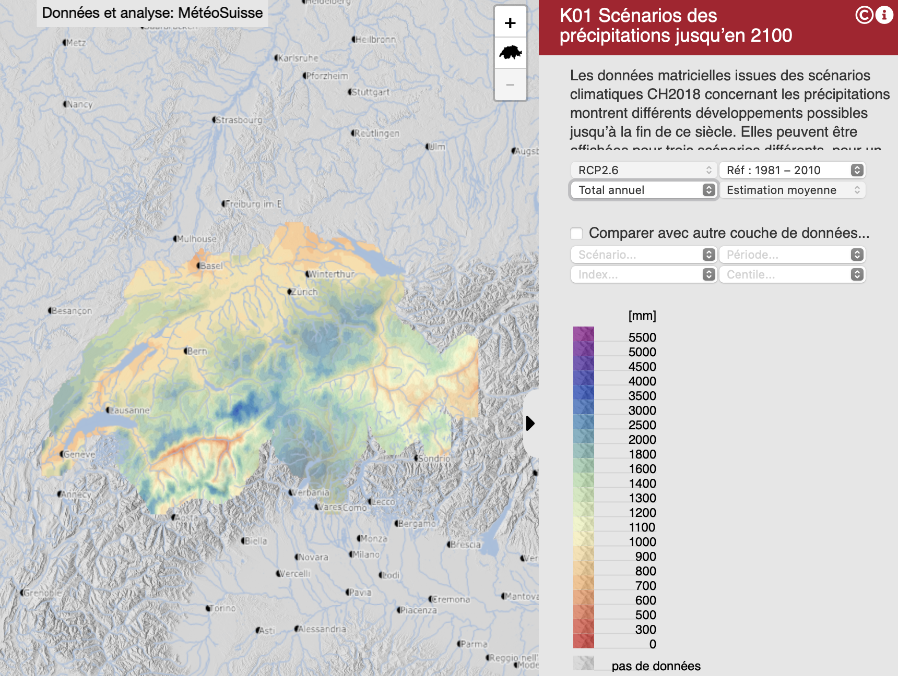
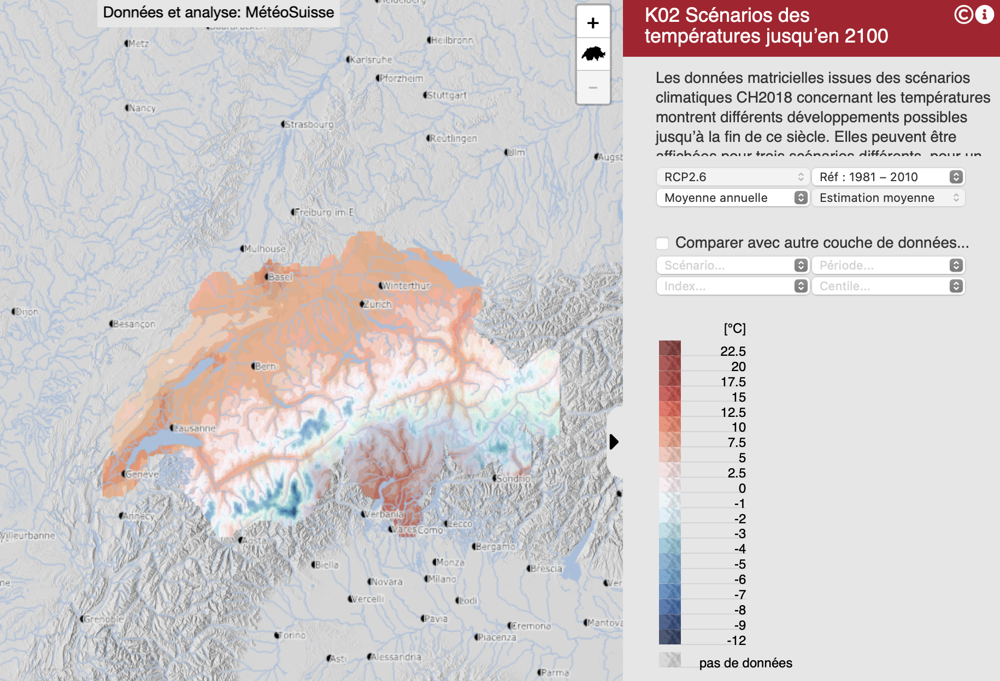
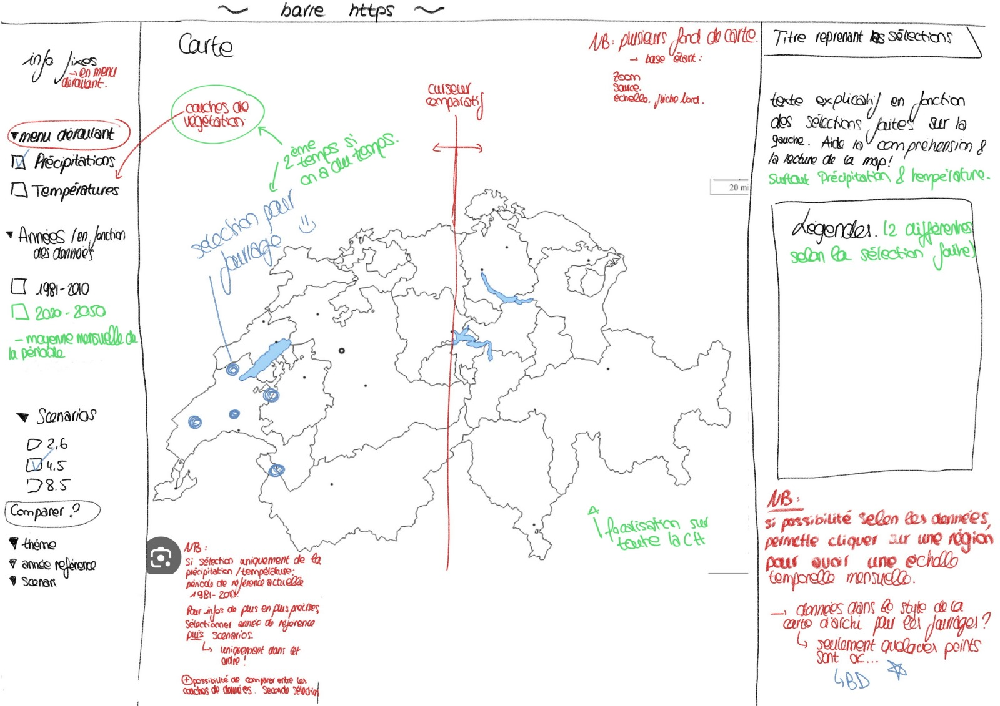
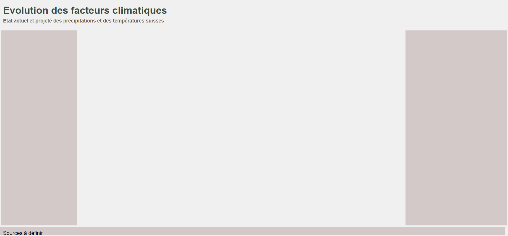
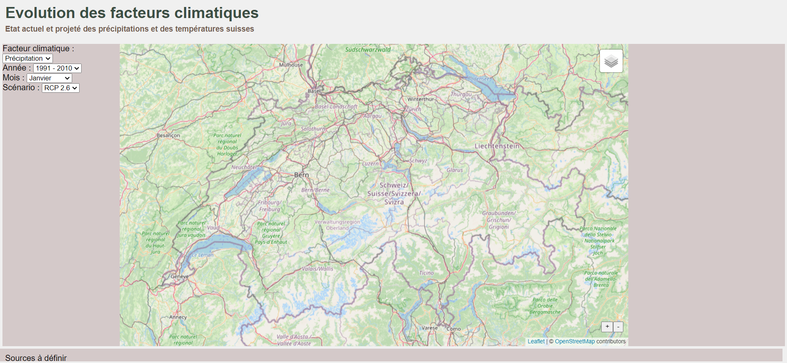
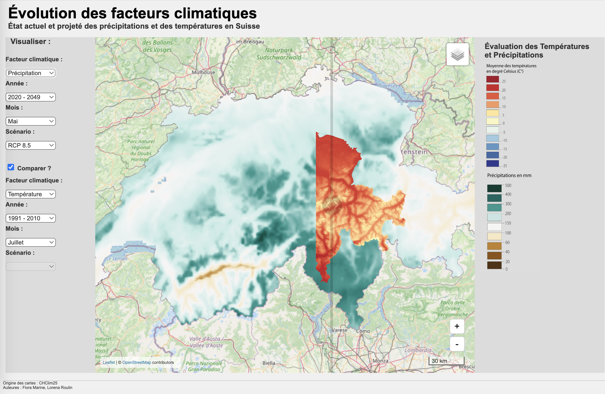

# Description et réflexions sur le déroulement du projet
Lorena Roulin et Marine Fiora

Université de Lausanne, mars 2024 - janvier 2025

# Introduction
Dans ce travail, nous prévoyons de réaliser une carte interactive qui présente l'évolution des précipitations et des températures en Suisse, selon la période actuelle et les différents scénarios du GIEC.

L'objectif est de montrer les projections mensuelles ou annuelles à l'horizon 2050, en utilisant la période de référence de 1981-2010. Nous voulons construire une carte dans laquelle nous pourrons sélectionner différentes informations telles que des données de précipitaion et de température, l'année de référence, le mois auquel nous voulons voir les données ainsi que des projections futures. Ainsi, il sera possible de visionner les valeurs climatiques dans le passé mais aussi dans le future grâce à des projections climatiques. Les différentes sélections permettrons de choisir l'une des différentes cartes climatiques et de l'afficher. De plus, les différentes informations relatives aux cartes apparaîtrons aussi, sur le côté de l'image. 

Avec cette idée de base en tête, nous allons créer une carte interactive sur Internet. Pour se faire, le language HTML sera utilisé. Celui-ci est pratique et peut fonctionner en conjonction avec le langage CSS (style) et le Javascript (JS, pour l'interactivité). Ces différents éléments et les différentes étapes de la réalisation de la carte seront décrits dans la suite de ce document. 

# Source d'inspiration pour le projet 
Pour concevoir ce travail, nous nous sommes inspirées des cartes de températures et de précipitations réalisées dans l'Atlas hydrologique de la Suisse. Ces cartes interactives présentent l'évolution des températures et des précipitations selon les scénarios CH2018.

## Exemple de carte des précipitations 


## Exemple de carte des températures 


# Données utilisées 
Il n’a pas été facile de trouver des données correspondant aux besoins de notre travail. Nous avons donc exploré différentes sources avant de trouver celles finalement utilisées ici.

Afin de réaliser les différentes cartes pour notre carte interactive nous avons pris les données suivantes : https://zenodo.org/communities/chclim25/about

Ces données font partie de CHclim25, un ensemble de données climatiques pour la Suisse avec une résolution de 25 m x 25 m. Elles incluent des couches mensuelles et annuelles pour la température et les précipitations, ainsi que d'autres variables climatiques (non utilisées dans ce travail).

L’ensemble de données est dérivé d'un jeu de données à grille quotidienne avec une résolution de 1 km fourni par l'Office fédéral de météorologie et de climatologie (MeteoSwiss). Cette base a été affinée par une méthode de réduction d’échelle, appliquant des régressions locales avec un modèle d'élévation de 25 m de résolution pour mieux intégrer la topographie locale et les phénomènes climatiques complexes associés.

Les couches climatiques sont disponibles au format geoTIFF pour la période de référence 1981-2010 ainsi que pour trois périodes futures (2020-2049, 2045-2074 et 2070-2099). Elles tiennent compte de trois modèles de circulation (GCM-RCM) et de trois scénarios de concentration représentatifs (RCP) issus de l’initiative CH2018. 

## Données des précipitations 
Lien des données des précipitations moyennes : https://zenodo.org/records/7868383

Les données de précipitations proviennent de la grille quotidienne de 1 km de MétéoSuisse, réduite à une résolution de 25 m par interpolation bilinéaire. Les couches mensuelles et annuelles moyennes pour la période actuelle (1981-2010) et les périodes futures (2020-2049, 2045-2074, et 2070-2099) sont disponibles. Cependant, pour notre carte, nous avons limité la période à celle s'étendant de 2020 à 2049 pour des raisons de temps et de praticité.

## Données des températures  
Lien des données des températures moyennes : https://zenodo.org/records/7859252

Les températures moyennes de l'air à 2 m sont issues d'un ensemble de données quotidien à 1 km de résolution de MétéoSuisse, ajusté à 25 m via une régression locale avec un modèle d'altitude. Les couches mensuelles et annuelles pour la période actuelle (1981-2010) et pour les futures moyennes (2020-2049, 2045-2074 et 2070-2099) sont disponibles. Cependant, pour notre carte, nous avons limité la période à celle s'étendant de 2020 à 2049 pour des raisons de temps et de praticité.

# Visuel la carte
Tout d'abord, nous avons pris le temps de faire un croquis pour visualiser la carte souhaitée pour ce projet, ce qui nous a aidés à mieux nous projeter et à estimer le travail nécessaire pour la créer. Cela nous a également permis de déterminer par où commencer pour réaliser la carte. Par la réalisation de ce croquis, nuus avons également réalisé que nous avions vu un peu grand pour commencer, et que certaines choses prévues initialement n'ont pas pu être réalisées par manque de temps.

La carte interactive finale sera probablement présentée sous cette forme :


## Eléments de la carte
Sur la gauche de la carte, nous retrouverons les informations fixes ; au centre se trouvera la carte et, à droite, les informations qui varient en fonction des sélections faites dans le menu de gauche.

À gauche, nous trouverons plusieurs menus déroulants. L'utilisateur pourra sélectionner plusieurs options, et seulement celles-ci apparaîtront. Il y a globalement quatre choix pour l'utilisateur.

1. Le thème de la carte : précipitations ou températures.
2. L'année : de référence 1981-2010 ou projections pour les années 2020-2049. 
3. Le mois : le mois de l'année peut être sélectionné. 
4. Le scénario du GIEC : RCP2.6, RCP4.5, RCP8.5. 

Si l'utilisateur ne souhaite pas faire de projections futures, il peut sélectionner uniquement le thème de la carte, qui s'affichera alors avec la période de référence actuelle, soit 1981-2010. Pour obtenir des informations plus précises, il peut choisir d'activer les options 2, 3 et 4.

De plus, une option "Comparer" se trouve sous ces choix, permettant de créer un second ensemble de paramètres identique au premier. Ainsi, deux ensembles de choix pourront apparaître sur la carte pour faciliter la comparaison, directement visible grâce à une barre de défilement verticale qui sert de curseur. En déplaçant le curseur, les données de l'un ou l'autre choix sont affichées.

La carte centrale occupera la majeure partie de l'écran, avec une vue de la Suisse et plusieurs options de fond de carte (MNT, relief, etc.). Une fonction de zoom permettra d'afficher des détails précis, bien que nous devrons en limiter l'ampleur selon la résolution des pixels disponibles. Les éléments essentiels, tels que la flèche du nord, l'échelle, les sources et les auteurs, seront également présents.

Sur la droite, les informations contextuelles et variables seront affichées. Le thème sélectionné servira de titre en haut de cette section, et un texte explicatif apparaîtra en fonction des choix effectués à gauche, facilitant la compréhension et l'interprétation de la carte. Les légendes nécessaires se trouveront aussi dans cet espace.

## Pourquoi ces choix ?
Nous souhaitons que la carte soit la plus claire possible, avec trois sections : "choix," "carte" et "informations." Nous avons opté pour une mise en page en forme de F, plaçant les informations les plus importantes à gauche, là où le regard se pose en premier. Cette section est essentielle, car elle permet de sélectionner les éléments à afficher, tout en restant suffisamment étroite pour maximiser l'espace dédié à la visualisation des données.

Le choix du menu déroulant est une question de lisibilité. Nous voulons que cette partie soit aussi claire et compréhensible que possible, car moins c’est souvent mieux. Nous avons également intégré la section "choix de comparaison" dans cette partie pour garantir une lisibilité optimale. En présentant les deux choix côte à côte, nous favorisons une meilleure comparaison.

La carte est placée au centre, ce qui permet de séparer les informations textuelles et d’aérer l’ensemble. L’objectif est de rendre la carte aussi grande que possible.

La partie droite comprend des informations relatives aux choix ainsi que les légendes associées. Elle suit la logique de gauche à droite : choix → visualisation → explications.


# Marche à suivre pour la réalisation de la carte interactive
Dans ce travail, nous allons donc créer une carte interactive permettant de sélectionner différentes informations, telles que les données de précipitations et de températures, l'année de référence, le mois pour lequel nous voulons voir les données, ainsi que des projections futures. Il sera ainsi possible de visualiser les valeurs climatiques du passé mais aussi du futur grâce aux projections climatiques. Les différentes options permettront de choisir l'une des cartes climatiques et de l'afficher. De plus, les informations relatives aux cartes apparaîtront également sur le côté de l'image.

Avec cette idée de base en tête, nous allons créer une carte interactive en ligne. Pour ce faire, le langage HTML sera utilisé. Celui-ci est pratique et peut fonctionner en conjonction avec le CSS (pour le style) et le JavaScript (JS, pour l'interactivité). Ces différents éléments seront décrits plus tard.

# 1. Créer la base du HTML
Pour commencer, un document HTML a été créé et est composé de plusieurs éléments. Dans notre cas, nous allons nous concentrer sur trois d'entre eux : `<html>`, `<head>`, et `<body>`.

Chaque élément fonctionne comme un tiroir qui peut contenir d'autres éléments. Pour ajouter un élément, vous devez l'ouvrir en utilisant des chevrons autour de son nom, comme ceci : <...>. Pour fermer cet élément, vous devez ajouter un / à l'intérieur des chevrons, comme ceci : </...>. Cette logique est utilisée pour chaque élément de l'HTML.

Par exemple : l'élément HTML principal s'ouvre avec  `<html>` et se ferme avec `</html>`. À l'intérieur de la balise html, vous pouvez avoir un `<head>` pour les métadonnées et un `<body>` pour le contenu visible de la page, chacun ayant sa propre balise d'ouverture et de fermeture.

## 1.1 Le contenu de la page web
Pour notre carte, nous voulons créer trois parties principales. La première étape est alors de diviser l'écran en différentes parties en utilisant des div. Une div est donc un élément HTML utilisé pour créer des sections sur une page web et ainsi structurer notre code et notre page. Il est aussi possible de mettre des titres et des sous-titres aux différents éléments. `<h1>...</h1>` correspond au titre un, `<h2>...</h2>` au titre deux et ainsi de suite. 

Ainsi, pour créer notre carte, nous avons besoin de deux balises `<div>`. Le premier `<div>` contiendra les menus de sélection, la carte et les informations, et le second `<div>` sera réservé aux sources. Le premier `<div>` est appelé "container", car il sert de réceptacle pour la majorité du contenu de notre site. Le second `<div>`, nommé "footer", contiendra les différentes sources d'information.

Ensuite, nous avons continué de subdiviser notre `<div>` "container" en trois parties: "left", "map" et "right" afin d'organiser l'espace. Chaque `<div>` utilise une "class" et un "id". La "class" permet d'appliquer des styles communs à plusieurs éléments, tandis que l'"id" est unique et sert à cibler un élément précis pour des modifications spécifiques.

# 2. Le CSS
## 2.1 Modifier le style des différents éléments
Il existe trois manières principales de sélectionner les éléments à styliser dans notre CSS.

1. Sélectionner un élément HTML : Pour cibler des balises HTML spécifiques, comme le corps du texte (body), il suffit de nommer la balise directement dans le CSS. Par exemple, pour styliser le corps du texte, on écrit simplement body suivi d'accolades.

```css
body {
}
```
2. Sélectionner par classe : Pour sélectionner tous les éléments partageant la même classe, comme class="container", on utilise un point (.) suivi du nom de la classe. Cela permet de styliser en une seule fois tous les éléments qui partagent cette classe.

```css
.container {

}
```
3. Sélectionner par identifiant : Pour cibler un élément unique sur la page, comme notre élément avec l'identifiant id="map", on utilise le symbole # suivi de l'identifiant. Cette méthode s'applique spécifiquement à un seul élément.

```css
#map {

}
```

Dans les accolades, nous inscrivons les règles de style que nous voulons appliquer à l'élément sélectionné. Chaque ligne dans les accolades définit une propriété de style et sa valeur. Chaque propriété suit ce format : propriété: valeur. Voici quelques-unes des principales propriétés que vous pouvez utiliser :

```css

  font-family : Définit la police de caractère pour l'élément.
  font-weight : Spécifie l'épaisseur du texte, par exemple en gras ou italique.
  background-color : Définit la couleur de l'arrière-plan de l'élément.
  color : Change la couleur du texte.
  margin : Ajuste la marge extérieure autour de l'élément.
  padding : Définit l'espace intérieur entre le contenu de l'élément et ses bordures.
  display: flex : Transforme l'élément en conteneur flexible, facilitant la disposition de ses enfants.
  flex-direction: column : Dispose les enfants de l'élément en une colonne verticale.
```
## 2.2 Modifier les tailles des éléments du "container"
Une fois les titres et le corps de texte stylisés, nous pouvons nous attaquer au style de notre "container". Comme indiqué dans notre HTML, le "container" contient trois sections auxquelles nous allons attribuer des tailles et des styles distincts. Nous allons donc styliser la classe .container ainsi que les classes qui la composent : .left, .main, et .right. Cela nous permettra d'organiser visuellement l'espace en définissant des proportions et des styles spécifiques pour chaque section.

Les différentes règles de style mentionnées précédemment peuvent être réutilisées ici. Pour éviter toute redondance, nous n'allons pas les expliquer à nouveau, mais vous pouvez vous référer à la section 2.2 pour affiner le visuel selon vos préférences.

### 2.2.1 Gestion de la taille des différents `<div> `
Nous allons maintenant nous concentrer sur la gestion de la taille des différents  `<div> `, en utilisant principalement trois règles de style :

width : définit la largeur du conteneur.
height : définit la hauteur du conteneur.
flex : spécifie les propriétés flexibles de l'élément lorsqu'il est utilisé dans un conteneur avec la propriété display: flex (décrit en section 2.1).

### 2.2.2 Stylisation du "container"
Commençons par le conteneur principal. Nous souhaitons qu'il occupe toute la largeur de l'écran tout en ayant une hauteur maximale. Les règles de style pour cela sont les suivantes :

 ```css
.container {
  width: 100%;
  height: calc(100vh - Npx)
}
 ```

Ainsi, le  `<div> ` occupera 100% de la largeur de l'écran et une bonne partie de la hauteur. La hauteur est calculée à l'aide de la fonction calc(), qui permet d'ajuster dynamiquement la taille. Dans cet exemple, nous utilisons 100vh (100% de la hauteur de la fenêtre) et nous soustrayons N pixels pour tenir compte des titres, marges et autres éléments présents sur la page. Ceci peut aussi être fait avec nos autres  `<div> ` tel que le footer.

### 2.2.3 Stylisation des éléments enfants (.left, .main, .right)
Une fois le conteneur défini, nous pouvons nous concentrer sur les  `<div> ` enfants : .left, .main, et .right. Étant donné que la taille du conteneur est déjà spécifiée, il ne reste qu'à définir la taille des  `<div> ` enfants en utilisant la propriété flex.

Par exemple pour .left:
 ```css
.left {
  flex: 2 1 15%;
}
 ```

* Le premier chiffre (2) est le facteur de croissance, indiquant que cet élément peut occuper deux fois plus d'espace que les autres.
* Le second chiffre (1) est le facteur de rétrécissement, ce qui permet à l'élément de se réduire si l'espace est limité.
* Le pourcentage (15%) représente la taille de base de l'élément.

Pour les blocs .left et .right, nous avons flex: 2 1 n%, ce qui signifie qu'ils commencent à une taille de n% du conteneur et peuvent s'agrandir ou se rétrécir selon l'espace disponible. L'élément central .main, plus grand, utilise flex: 1 1 65%, ce qui lui permet de commencer à 65% du conteneur et de s'ajuster de manière égale aux autres éléments.

### 2.2.4 Astuce : Visualisation des  `<div> `
Pour mieux visualiser l’organisation des différentes sections, vous pouvez leur appliquer des couleurs de fond temporaires via la propriété background-color. Cela vous aidera à ajuster plus facilement les tailles et les proportions des éléments.

A ce stade, votre page ressemble à ceci: 



# 3. Le JS
## 3.1 Lier le JS au HTML
Le début du script commencera alors avec: 

 ```javascript
document.addEventListener('DOMContentLoaded', function() {

} 
```

Cette fonction permet de charger complètement l'HTML avant d'exécuter le script, ce qui évite divers problèmes.

## 3.2 Ajouter des fonds de carte
Le premier élément à intégrer dans notre  `<div class="map"> ` est un fond de carte, centré sur la Suisse.

### 3.2.1 Créer la carte
Pour commencer, nous allons créer une variable map qui contiendra notre carte. Cette variable va utiliser Leaflet pour générer une carte centrée sur les coordonnées de la Suisse avec un niveau de zoom approprié.

 ```javascript
  var map = L.map('map', {
    center: [46.8, 8.2275],
    zoom: 8,
  });

 ```

Ici, la fonction  `L.map('map') ` crée une carte Leaflet qui sera affichée dans l'élément  `<div id="map"> `. Le centre de la carte est défini par les coordonnées de la Suisse, et le zoom est ajusté pour afficher tout le pays.

### 3.2.2 Limitation de la zone géographique
Pour éviter que les utilisateurs ne puissent naviguer trop loin de la Suisse lors de l'interactivité avec la carte, nous allons définir des limites géographiques et un zoom minimal :

 ```javascript
  map.setMaxBounds([[45.5, 5.0], [48.0, 11.5]]);
  map.setMinZoom(8);
 ```
La fonction setMaxBounds fixe une zone au-delà de laquelle la carte ne pourra pas être déplacée. setMinZoom empêche les utilisateurs de trop dézoomer et de s'éloigner trop loin de la zone qui nous intéresse.

### 3.2.3 Ajout d'une couche de fond (fond de carte)
Ensuite, nous allons ajouter un fond de carte à notre projet. Ici, nous utilisons une carte topographique fournie par ESRI. Pour cela, nous créons une variable topoEsri qui ajoute une couche à notre carte via une tuile Leaflet (L.tileLayer), tout en respectant les attributions de la carte :

 ```javascript
  var topoEsri = L.tileLayer('https://services.arcgisonline.com/ArcGIS/rest/services/World_Topo_Map/MapServer/tile/{z}/{y}/{x}', {
    attribution: '&copy; <a href="http://www.esri.com">Esri</a>, HERE, Garmin, Intermap, increment P Corp., GEBCO, USGS, FAO, NPS, NRCAN, GeoBase, IGN, Kadaster NL, Ordnance Survey, Esri Japan, METI, Esri China (Hong Kong), (c) OpenStreetMap contributors, and the GIS User Community'
  });
  ```
  
Puis, nous ajoutons cette couche à la carte grâce à: 
 ```javascript
  topoEsri.addTo(map);
  ```

### 3.2.4 Ajouter plusieurs fonds de carte
Il est possible d'ajouter plusieurs fonds de carte au projet. Ceci se fait de la même manière que dans le point 3.2.3. Par exemple, si vous voulez ajouter une couche OpenStreetMap en plus de la couche ESRI, vous devez créer une autre variable pour cette nouvelle couche et regrouper les deux couches dans une variable appelée baseLayers :

```javascript
  var baseLayers = {
    "ESRI": topoEsri,
    "OpenStreetMap": osmLayer,
  };
```

### 3.2.5 Contrôler les couches
Pour permettre aux utilisateurs de basculer entre différentes couches (fonds de carte), nous utilisons L.control.layers, qui va afficher un contrôle pour gérer les couches disponibles. 

```javascript
  var overlays = {};
  L.control.layers(baseLayers, overlays).addTo(map);
```
Ce code ajoute une interface de contrôle qui permet de basculer entre les différentes couches de base (ici, ESRI et OpenStreetMap). Si des couches superposées sont ajoutées, elles peuvent également être contrôlées via cet élément.

## 3.3 Ajouter le bouton zoom et dézoom sur la carte
Pour améliorer l'interaction avec notre carte, nous allons ajouter deux boutons en bas à droite : un pour zoomer et un autre pour dézoomer. Voici comment procéder :

### 3.3.1 Créer d'un contrôle de zoom
Nous commençons par créer une variable pour le contrôle de zoom, en le positionnant en bas à droite de la carte. Il y a deux styles de fonction, l'une qui permet de zoomer et l'autre de dézoomer en fonction du bouton utilisé. 

```javascript
  var zoomControl = L.control({ position: 'bottomright' });

  zoomControl.onAdd = function() {
    var container = L.DomUtil.create('div', 'zoom-control');
    var zoomInButton = L.DomUtil.create('button', 'zoom-in-button', container);
    zoomInButton.innerHTML = '+';
    zoomInButton.onclick = function() {
      map.zoomIn();
    };
    var zoomOutButton = L.DomUtil.create('button', 'zoom-out-button', container);
    zoomOutButton.innerHTML = '-';
    zoomOutButton.onclick = function() {
      map.zoomOut();
    };
    return container;
  };

  zoomControl.addTo(map); 
```

# 4. Créer des menus déroulants
## 4.1 Créer des menus déroulants pour les filtres de sélection
Nous créons quatre types de filtres :

* Facteurs climatiques (précipitations ou températures)
* Année de référence (1991-2010 ou 2020-2049)
* Mois de l'année (janvier à décembre)
* Scénarios RCP (RCP2.6, RCP4.5, RCP8.5)

Ces menus permettront à l'utilisateur de sélectionner les paramètres nécessaires pour afficher la carte correspondante. Pour cela, nous utilisons des éléments HTML `<select>` pour les menus déroulants, et `<option>` pour chaque choix. Les options peuvent de ce fait, être très nombreuses en fonction du nombre d'éléments à choix. Ces différents filtres pourront être sélectionnés dans la partie "left" de notre "container" et ces informations sont ajoutées dans le HTML.

```html
    <div class = "left" id="info">
      <div id="climatic-factor">
        <label for="data-selection">Facteur climatique :</label>
        <select id="data-selection">
          <option value="precipitation">Précipitation</option>
          <option value="temperature">Température</option>
        </select>
      </div>
      ...
    </div>
```

Nous allons donc procéder de la même manière pour le choix de l'année de référence (year), des mois (month), ainsi que du scénario (scenario). Ces différents filtres sont ajoutés à la suite des différents div. À ce stade, nous avons donc quatre menus déroulants dans la partie gauche (left).



## 4.2 Ajouter une section de comparaison
Maintenant que nous avons les onglets pour la sélection des différents filtres pour nos cartes, nous voulons mettre en place une seconde sélection afin de permettre la comparaison entre deux cartes. Pour se faire, nous allons créer deux `<div>` dans notre `<div class = "left" id="info">`. Nous allons en créer un qui s'appelle "origin", dans lequel nous allons glisser les différents éléments que nous avons fait ci-dessus, et un second appelé "comparison" qui sera identique et qui permettra d'afficher la seconde carte pour la comparaison. Afin d'éviter toute ambiguité, les noms des différents filtres de cette parties seront précédé d'un "comparison". Nous aurons alors les identifiants "comparison-climatic-factor", "comparison-year", "comparison-month" et "comparison-scenario". De plus, le titre des différentes sections `<h3></h3>` ajoutent aussi plus de clarté. 

Notre HTML devrait alors ressembler à ceci:

```html
    <div class = "left" id="info">
    <h3> Visualiser: </h3>
      <div class="origin">
        <div id="climatic-factor">
          <label for="data-selection">Facteur climatique :</label>
          <select id="data-selection">
            <option value="precipitation">Précipitation</option>
            <option value="temperature">Température</option>
          </select>
        </div>
        ...

      <div class = "comparison">
        <h3> Comparer avec: </h3>
        <div id="comparison-climatic-factor">
          <label for="comparison-data-selection">Facteur climatique :</label>
          <select id="comparison-data-selection">
            <option value="comparison-precipitation">Précipitation</option>
            <option value="comparison-temperature">Température</option>
          </select>
        </div> 
        ... 
    </div>
```

Ces différents éléments peuvent également être modifiés dans le CSS pour un style visuellement plus agréable. Cependant, nous n'allons pas y revenir, car la méthode est identique à celle présentée plus haut. La même logique est ensuite utilisée pour les sélections des années, du mois et des scénarios climatiques. 

## 4.3 Bloquer le choix les scénarios
Ces fonctions permettent de bloquer le choix des scénarios futurs lorsque les années actuelles sont sélectionnées. La fonction 'gererSelectionAnnee()' bloque le choix des scénarios pour l'image de base, tandis que la fonction 'toggleScenarioSelection()' bloque ceux pour l'image de comparaison.

```js
// Bloque le choix des scénarios pour l'image de base
function gererSelectionAnnee(){
    const anneeSelectionnee = document.getElementById("year-selection").value;
    const scenarioMenu = document.getElementById("scenario-selection");

    if (anneeSelectionnee == "20-49"){
      scenarioMenu.disabled = false;
    } else{
      scenarioMenu.disabled = true;
      scenarioMenu.value = "";
    }
    afficherSelectionOrigin();
  }

// Bloque le choix des scénarios pour l'image de comparaison
function toggleScenarioSelection() {
  const yearSelection = document.getElementById('comparison-year-selection');
  const scenarioSelection = document.getElementById('comparison-scenario-selection');
    
  // Si "1991-2010" est sélectionné, vider le menu scénario et le désactiver
  if (yearSelection.value === '91-10') {
    scenarioSelection.innerHTML = ""; // Vider les options
    scenarioSelection.disabled = true; // Désactiver le menu scénario
  } else {
    // Sinon, réactiver le menu scénario et ajouter les options possibles
    scenarioSelection.disabled = false;
    // Ajout des options du scénario (à adapter selon tes besoins)
    const options = [
      { value: "rcp2.6", text: "RCP 2.6" },
      { value: "rcp4.5", text: "RCP 4.5" },
      { value: "rcp8.5", text: "RCP 8.5" },
    ];
      
    // Remplir le menu scénario si ce n'est pas déjà fait
    if (scenarioSelection.options.length === 0) {
      options.forEach(option => {
        const opt = document.createElement("option");
        opt.value = option.value;
        opt.text = option.text;
        scenarioSelection.add(opt);
      });
    }
  }
}
```

## 4.4 Créer les toggle pour la sélection de comparaison
Cette fonction permet que lorsque l'option de comparaison est sélectionnée, elle fait apparaître les différentes options de comparaison (facteur climatique, années de comparaison, les mois ainsi que les scénarios climatiques) ainsi que le curseur, qui s'affiche au centre de l'image.

```js
  const dragLine = document.querySelector(".slider .drag-line");
  const sliderIcon = document.querySelector(".slider .slider-icon");

  function toggleComparisonMenu() {
    const comparisonCheckbox = document.getElementById('comparison-checkbox');
    console.log('Éat de la case à cocher dans toggleComparisonMenu :', comparisonCheckbox.checked);

    const comparisonElements = [
      document.getElementById('comparison-climatic-factor'),
      document.getElementById('comparison-year'),
      document.getElementById('comparison-month'),
      document.getElementById('comparison-scenario')
    ];

    // Si la case est cochée, afficher les éléments de comparaison et le slider
    if (comparisonCheckbox.checked) {
      comparisonElements.forEach(element => {
        element.style.display = 'block';
      });
      document.querySelector(".slider").style.display = "block";  // Afficher le slider
      dragLine.style.display = 'block';  // Afficher le dragLine
      sliderIcon.style.display = 'block';  // Afficher le sliderIcon
      toggleScenarioSelection(); // Appliquer les règles pour l'année sélectionnée
    } else {
      // Sinon, cacher les éléments de comparaison et le slider
      comparisonElements.forEach(element => {
        element.style.display = 'none';
      });
      document.querySelector(".slider").style.display = "none";  // Masquer le slider
      dragLine.style.display = 'none';  // Masquer le dragLine
      sliderIcon.style.display = 'none';  // Masquer le sliderIcon
    }
  }
  ```

# 5. Afficher les différentes images 
Cette fonction permet d'afficher les différentes images en fonction des options sélectionnées par l'utilisateur. Les images sont nommées selon une structure spécifique comprenant le facteur climatique, l'année, le mois, et le scénario. En fonction de l'année choisie (1991-2010 ou 2020-2049), le code détermine s'il doit utiliser un scénario ou non pour rechercher l'image correspondante. Une fois cette image identifiée, un nouvel URL est généré pour l'afficher sur la carte.

Ce nouvel URL est ensuite chargé dynamiquement sur la carte, garantissant que chaque changement dans les sélections (facteur, année, mois, ou scénario) met immédiatement à jour la carte avec l'image correspondante. Cette même approche est également appliquée pour les images utilisées dans le cadre de la comparaison, permettant d'afficher les deux images côte à côte de manière cohérente.

```js
// Créer le nom du fichier de l'image en fonction des sélections de l'utilisateur de la carte
    let imageNom;
    if (annee === "91-10") {
      imageNom = `${facteurClimatique}_${annee}_${mois}.png`;
    } else if (annee === "20-49") {
      imageNom = `${facteurClimatique}_${annee}_${mois}_${scenario}.png`;
    }

    // Créer le nouveau chemin de l'image à chaque fois que la sélection est modifiée
    const URLImage = `../cartes/${imageNom}`;
```

# 6. Interactivité avec le slider
Le fonctionnement du slider repose sur un lien avec le CSS. La position du curseur détermine une valeur qui s'étend d'une extrémité à l'autre de la carte (de droite à gauche). Cette interaction est gérée par la propriété 'imageComparison.style.clipPath' dans le CSS, qui contrôle la manière dont l'image située à gauche est "coupée" (ou clipée) en fonction de la position du slider. Cela permet de montrer dynamiquement les parties correspondantes des deux images affichées sur la carte, créant ainsi un effet de comparaison visuel. 

```js
slider.addEventListener('input', (e) => {
      const sliderValue = e.target.value;
      const maxClipValue = 100; // Valeur maximum du clip (100%)
      const newClipValue = Math.min(sliderValue, maxClipValue); // Assurez-vous qu'il ne dépasse pas 100%
      
      // Appliquez le clipPath pour masquer la partie gauche de l'image
      imageComparison.style.clipPath = `inset(0 0 0 ${newClipValue}%)`;
  }); 
```

# 7. Afficher les légendes
Cette partie du code gère l'affichage des légendes en fonction des éléments sélectionnés et de la carte affichée. Les différentes options d'affichage des légendes sont détaillées dans le code ci-dessous.

```js
// Fonction updateLegend qui utilise selectedComparisonValue
function updateLegend() {
  // Si aucune option n'est sélectionnée (!), rien ne s'affiche. Cela signifie que l'affichage des éléments est conditionné à la sélection d'une option spécifique. En l'absence de sélection, aucun contenu ou image ne sera visible.
  if (!selectedValue && !selectedComparisonValue && !comparisonCheckbox.checked) {
    legendDiv.innerHTML = '<p>Aucune donnée sélectionnée. Veuillez choisir une option.</p>';
    console.log("Aucune donnée sélectionnée.");
    return;
  }
  // Si aucune des conditions mentionnées ci-dessus n'est remplie, les données non reconnues seront affichées.
  if (!selectedValue || !selectedComparisonValue) {
    legendDiv.innerHTML = '<p>Données non reconnues. Veuillez vérifier votre sélection.</p>';
    console.log("Données non reconnues.");
  }

  // Si le checkbox de comparaison n'est pas activé
  if (!comparisonCheckbox.checked) {
    console.log("Selected Data:", selectedValue);  // Vérifie la sélection des données
    // Lorsque le facteur climatique des précipitations est sélectionnée, la légende des précipitations s'affiche.
    if (selectedValue === 'precipitation') {
      legendDiv.innerHTML = `
        <h3>Évaluation des Précipitations</h3>
        <p>texte de la légende</p>
        
      `;
      console.log("Affichage légende précipitations");
      // Lorsque le facteur climatique des températures est sélectionnée, la légende des températures s'affiche.
    } else if (selectedValue === 'temperature') {
      legendDiv.innerHTML = `
        <h3>Évaluation des Températures</h3>
        <p>texte de la légende</p>
        
      `;
      console.log("Affichage légende températures");
    }
  } else if (comparisonCheckbox.checked) {
    console.log("Checkbox activée. Comparaison des deux valeurs...");
    // Si la case à cocher de comparaison est activée, les deux valeurs sont comparées
    // En cas de sélection des précipitations pour les deux images, la légende des précipitations s'affiche 
    if (selectedValue === 'precipitation' && selectedComparisonValue === 'comparison-precipitation') {
      console.log("Les deux sélections sont 'precipitation'. Affichage de la légende des précipitations uniquement.");
      legendDiv.innerHTML = `
        <h3>Évaluation des Précipitations - Comparaison de données</h3>
        <p>texte de la légende</p>
        
      `;
      // En cas de sélection des températures pour les deux images, la légende des températures s'affiche 
    } else if (selectedValue === 'temperature' && selectedComparisonValue === 'comparison-temperature') {
      console.log("Les deux sélections sont 'temperature'. Affichage de la légende des températures uniquement.");
      legendDiv.innerHTML = `
        <h3>Évaluation des Températures</h3>
        <p>texte de la légende</p>
        
      `;
    } else {
      console.log("Les sélections sont différentes ou non définies. Affichage des deux légendes.");
      console.log("selectedValue:", selectedValue, "| selectedComparisonValue:", selectedComparisonValue);
      //En cas de sélection de la comparaison entre les températures et les précipitations, les deux légendes s'affichent simultanément.
      legendDiv.innerHTML = `
        <h3>Évaluation des Températures et Précipitations</h3>
        
        
      `;
    }
  }
  };
```

# 8. Remarques, limites et difficultés
Un certain nombre de difficultés ont été rencontrées durant la conception de cette carte.

Premièrement, la recherche des données a été complexe, car nous n'avons pas trouvé tout de suite des données correspondant à nos besoins, notamment pour la réalisation des cartes. De plus, les volumes de données étaient relativement importants, ce qui a compliqué leur traitement.

Ensuite, nous avons rencontré des difficultés pour faire correspondre les projections des images et du fond de carte, afin qu'elles se superposent correctement.

L'utilisation de Git a également posé plusieurs problèmes durant la réalisation de notre travail. Cependant, nous avons réussi à l'utiliser à deux, mais seulement à la fin du projet.

Puis, plusieurs problèmes ont été rencontrés lors de l'utilisation du curseur comparatif entre les cartes. Dès que le curseur est activé, aucune autre fonctionnalité de la carte ne fonctionne correctement, notamment le zoom et le changement de fond de carte. De plus, l'image de comparaison présente des problèmes de projection et d'emprise, bien que les images soient identiques. Un autre problème est que l'image ne suit pas correctement le curseur, se décalant sur les extrémités, ce qui rend la comparaison imprécise. 

Enfin, le scroller pour la légende ne fonctionne pas correctement, rendant difficile la navigation et l'affichage des informations associées à l'image.



Pour terminer, nous sommes relativement satisfaites de la réalisation de notre carte, bien qu'elle ne soit pas entièrement aboutie et que certaines fonctionnalités ne fonctionnent toujours pas correctement. Cependant, nous avons pu progresser et apprendre à surmonter les difficultés rencontrées.
