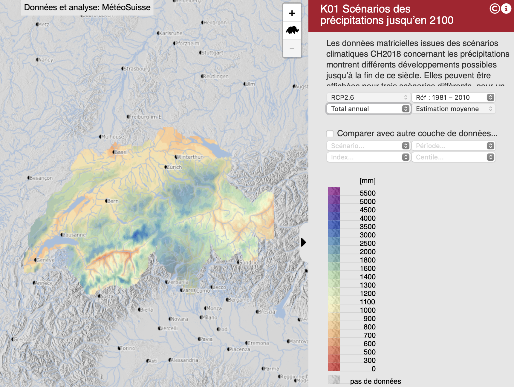
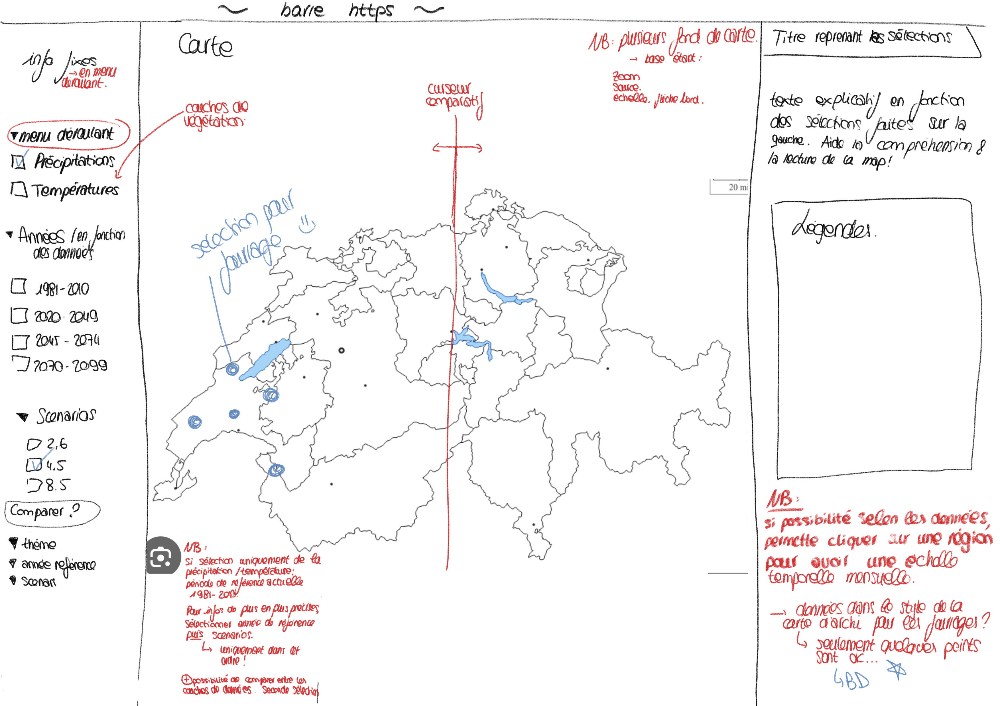

# Reflections sur le déroulement du projet
Lorena Roulin et Marine Fiora
Université de Lausanne, Mars 2024

# Introduction
Nous prévoyons de réaliser une carte interactive qui présente l'évolution des précipitations et des températures dans le futur à l'échelle de la Suisse, selon les différents scénarios du GIEC. 

L'idée est de présenter les projections par mois ou par année à l'horizon 2050, en fonction de la période de référence de 1981-2010. 

Nous allons nous inspirer de cartes interactives qui ont déjà été réalisées par le NCCS et par la Confédération que vous pouvez retrouver [ici](https://hydromapscc.ch/#fr/8/46.483/6.949/bl_hds--k01_k010001_rcp26_1995_00_medv0_1$531--k02_k020001_rcp26_1995_00_medv0_1$0/NULL).

## Exemple de carte des précipitations 

## Exemple de carte des températures 

Nous aimerions également, dans un deuxième temps, évaluer l'impact des précipitations et des températures futures sur la production fourragère dans les alpages suisses, soit aussi sous la forme d'une carte interactive, ou bien sous la forme de graphiques. 

### Projection des précipitations dans le futur 
Données sur les précipitations sur le site de la [Confédération suisse](https://www.bafu.admin.ch/). 

### Projection des températures dans le futur 
Données sur les températures : encore à trouver

# Cours du 10.04
A ce stade, nous avons trouvé plusieurs données climatiques. En premier, nous avons des données climatiques concernant directements les différentes stations météorologiques. Nous avons trouvé [ces données](https://www.meteosuisse.admin.ch/services-et-publications/applications/ext/climate-tables-homogenized.html) grâce à l'aide du Professeur Fallot qui nous les as indiquées. Cependant, nous ne pensons pas que ce soit les meilleures données à dispositions car elles ne montrent par l'évolution futures des températures. 

Nous avons ensuite trouvé certaines données climatiques sur le [site de la confédération](https://www.bafu.admin.ch/bafu/fr/home/etat/donnees/geodonnees/forets--geodonnees.html). Celles-ci ont des projections des températures maximales journalières de l'air en juillet avec des projections selon les RCP 2.6, 4.5 et 8.5. Nous trouvons que ces données seront bien plus précieuses. De plus, nous avons aussi des données concernant les précipitations cumulées entre avril et août de nouveau en fonction des mêmes RCP. Ceci est intéressant car il nous sera possible de calculer à l'échelle annuelle si c'est la directions que nous voulons suivre. Nous ne savons pas encore si ces donnée sont assez précises. Ces données sont dans majoritairement dans des format de DB (GDBTABLE) qui peuventt être ouvertes sur des logiciels comme ARGGIS.

Nous n'avons pas encore de données concernant les fourrages

Nous avons aussi vu qu'il était possible de commander des données sur Idaweb. Mais nous devons en discuter encore ensemble. 

# Rendez-vous du 13.04
Nous nous sommes rendu comptes que nous n'avions pas les données nécessaires pour les températures car les données minimales ne sont pas à disposition, ni les données annuelles. Nous avons donc décidé de commander des données sur l'Idaweb. Nous avons besoin de la signature du professeur responsable pour avoir l'accès aux données. 

Sur la carte, on pensait mettre la carte de la Suisse avec sur le côté les onglets selon les RCP. On peut aussi mettre une barre verticale qu'on peut déplacer de droite à gauche pour comparer plusieurs scénarios sélectionnés. 

On a aussi l'idée de pouvoir zoomer selon les différentes régions. On ne sait cependant pas encore exactement comment ça sera. Cela dépend des données à disposition. On se demande aussi si on sélectionne tous les cantons ou si on se focalise sur l'ouest de la Suisse (suisse romande) pour avoir des données potentiellement plus précises.

A voir comment on fera la map: js, d3?

# Cours du 17.04.2024

Nous avons fait signé le document à M.Kaiser que nous allons envoyé à météoSuisse. 

# Rendez-vous du 27.04.2024
Lorena à reçu les données de l'IDAweb mais on ne sais pas encore exactement comment utiliser ces données. Marine a aussi trouvée des données Raster en ce qui concerne les précipitations ainsi que les température en fonction des différents scenarios. Les données peuvent être ouvertes sur QGIS mais nous ne savons pas comment les lire. Nous devons en discuter avec Kaiser pour savoir exactement comment utiliser ces données et si elles sont exploitables. 

Pour ne pas perdre trop de temps, nous nous sommes mis à la réflection en ce qui concerne la forme sous laquelle nous voulons faire notre projet. Il sera surement sous cette forme: 

## Décorticons la carte
Sur la gauche de la carte, nous retrouverons les informations fixes, au centre la carte et sur la droite les informations qui varient en fonction des sélections faites sur le menu de gauche.

A gauche, on  trouvera alors plusieurs menus déroulants. Nous avons choisi d'opter pour des menus découlants notamment par soucis de lisibilité. De cette manière l'utilisateur pourra sélectionner plusieurs choix, et seulement ceux-ci apparaitrons. Il y a globalement 3 choix pour l'utilisateur. 

1. Le thème de la carte: précipitation, température, et idéalement aussi les couches de végétation. 
2. L'année de référence: 1981-2010, 2020-2049, 2045-2074, 2070-2099. Biensûr, les années pourront changer en fonction des données retenues. 
3. Le Scenario du GIEC: 2.6, 4.5, 8.5. 

Si l'utilisateur ne souhaite pas faire de projection future, il le peut. Dans ce cas, il ne sélectionne que le thème de la carte qui s'affichera avec la période de référence actuelle, soit 1981-2010. S'il désire des informations plus précises, il peut sélectionner les informations 2 et 3.

De plus, sous ces choix se trouve l'option "comparer" dans laquelle un second set de choix peut être fait. C'est une section identitique à celle des choix. Ainsi, deux set de choix pourront apparaître sur la carte ce qui permet une meilleure comparaison. Cette comparaison peut être faite directement sur la carte, en utilisant une barre verticale qui sert de curseur. En déplaçant le curseur, les données d'un choix ou d'un autre appraissent sur la carte. 

La carte au centre prendra la majorité de l'écran. On y trouvera la Suisse avec un choix de plusieurs fond de carte (tel que MNT, relief etc.) On y trouvera aussi une fonction de zoom afin de voir plus précisement une région. Nous devrons limiter le zoom en fonction de la résolution des pixels des données à disposition. On y trouvera aussi toutes les informations nécessaires aux cartes (flêche du nord, échelle, source, auteurs..). 
Cette carte pourrai aussi avoir de petits points (la forme reste à définir) qui pourront être sélectionnée. Ces points sont des sélections pour le fourrage et donneront plus amples information, à échelle réduite. Ces informaiton s'ouvrirons sur la droite de l'écran, sous les informations qui peuvent changer. 

Sur la droite se trouvent alors les informations variables. Au sommet de cette partie sera repris le thème sélectionné et fera office de titre. Sous celui-ci se trouvera un texte explicatif qui apparaitra selon les sélections faites sur la gauche. Ceci aidera la compréhension et la lecture de la map. Nous trouverons aussi dans cet espace les différentes légendes. 

## Pourquoi ces choix?
Nous voulons que la carte soit le plus clair possible avec une partie choix, une partie carte et une partie information. Nous avons choisis la logique du F avec les informations les plus importantes sur la gauche, là où le regard se pose en premier. C'est aussi la partie la plus importante de la carte car elle permet de sélectionner ce que l'on veut voir sur la carte. Cette partie n'est cependant pas excessivement large, de manière à laisser le plus de place possible pour la visualisation de donnée.

Le choix du menu déroulant est vraiment un soucis de lisibilité. Nous voulons que cette partie soit la plus claire possible, la plus compréhensible possible. En effet, less is more. Nous avons aussi pris le parti de mettre la séction "choix de comparaison" dans cette partie afin d'avoir encore une fois une lisibilité importante. Le fait de mettre côte à côte les deux choix permet aussi une meilleure comparaison. 

La carte est au centre. Ceci permet de diviser les informations textuelles et ainsi aérer le tout. Le but est évidemment de faire cette map la plus grande possible. 

La partie droite comprend des informations relatives à ces choix ainsi que les légendes qui y sont liées. Elle suit aussi la logique de droite à gauche avec le choix --> la visualisation --> les explications. 

## Données
Nous avons envoyé un mail à météosuisse afin de comprendre comment lire les différentes données. Nous avons aussi choisis de nous restreindre dans un premier temps a la température et les précipitations. De plus, nous voulions changer le nombres d'onglets de possibiités en ce qui concerne les choix de probabilité. 